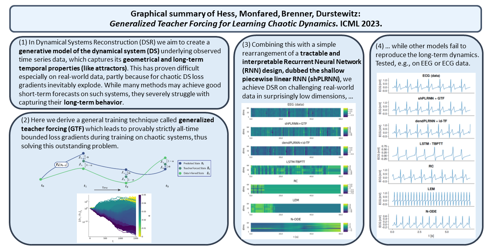

# [**Generalized Teacher Forcing for Learning Chaotic Dynamics [ICML 2023 Oral]**](https://icml.cc/virtual/2023/oral/25529)


## 1 Setup and usage
The entire project is written in [Julia](https://julialang.org/) using the [Flux](https://fluxml.ai/Flux.jl/stable/) deep learning stack.
### 1.1 Installation
Install the package in a new Julia environment:
```julia
julia> ]
(@v1.9) pkg> activate .
(GTF) pkg> instantiate
```
We recommend using the latest version of [Julia (>v1.9)](https://julialang.org/downloads/).

### 1.2 Ready-to-use experiment scripts
#### Running experiments
The folder `paper_experiments` holds subfolders for each dataset evaluated in the paper, in which you can find ready-to-use Julia scripts, which start and evaluate specific experiments of the paper (such as reproducing Table 1 results). For example, to run experiments using shPLRNN+GTF on the EEG dataset as in Table 1, run 
```bash
julia -t 1 --project paper_experiments/EEG/Table1/shPLRNN_GTF.jl -p 20 -r 20
```
which will start 20 processes with 1 thread each to train 20 models using the settings provided in `paper_experiments/ECG/Table1/shPLRNN_GTF.jl`. All datasets are stored in the folder `ICML2023_datasets`. The list of all settings can be found in the [default settings](settings/defaults.json) file. Any argument not overwritten in the experiment scripts will fall back to the default value found in that setting file.

#### Evaluating experiments
To evaluate experiments, run `evaluate.jl` with the appropriate arguments. For example, to evaluate the runs from the example above using four threads, run
```bash
julia -t 4 --project evaluate.jl -d ICML2023_datasets/EEG/EEG_test.npy -r Results/Table1-EEG-shPLRNN+GTF
```

## 2 General code documentation
### 2.1 Running single trainings
To start a single training, execute the `main.jl` file, where arguments can be passed via command line. For example, to train a 3D shallowPLRNN with 50 hidden units using GTF with constant $\alpha=0.1$, while keeping all other training parameters at their default setting, call
```bash
julia --project main.jl --model shallowPLRNN --latent_dim 3 --hidden_dim 50 --use_gtf true --gtf_alpha 0.1 --gtf_alpha_method "constant"
```
The [default settings](settings/defaults.json) can also be adjusted directly; one can then omit passing any arguments at the call site. The arguments are also listed in  in the [`argtable()`](src/parsing.jl) function.

### 2.2 Multiple runs + grid search
To run multiple trainings in parallel e.g. when grid searching hyperparameters, the `ubermain.jl` file is used. One has to adjust arguments which are supposed to differ from the [default settings](settings/defaults.json), and arguments that are supposed to be grid searched, in the `ubermain.jl` file itself. This is as simple as adding an `Argument` to the `GTF.ArgVec` vector, which is passed the hyperparameter name (e.g. `hidden_dim`), the desired value, and an identifier for discernibility and documentation purposes. If value is a vector of values, grid search for these hyperparameters is triggered. In this example, a total of $3\times2$ training tasks are prepared (3 `hidden_dim` and 2 `lat_model_regularization` settings).
```Julia
args = GTF.ArgVec([
    Argument("experiment", "grid_search_hidden_dim_and_regularization"),
    Argument("model", "shallowPLRNN"),
    Argument("hidden_dim", [10, 20, 30], "L"),
    Argument("lat_model_regularization", [1e-3, 1e-2], "lambda_lat"),
    # [...]
])
```
The identifier (e.g. `"L"` in the snippet above) is only mandatory for arguments subject to grid search. Once arguments are specified, call the ubermain file with the desired number of parallel worker processes (+ amount of threads per worker) and the number of independent runs per task/setting, e.g.
```bash
julia -t2 --project ubermain.jl -p 10 -r 5
```
will queue 5 runs for each setting and use 10 parallel workers with each 2 threads.

### 2.3 Evaluating experiments
You can evaluate entire experiments using `evaluate.jl` with the appropriate arguments. See the example given in 1.2 and check the script for additional parser arguments.
Note: Settings for measures are inferred from the training runs using the saved `args.json`. If you want to change the settings for evaluation, pass the correct parser argument in `evaluate.jl`. The settings for $D_{stsp}$ will type dispatch to either the binning variant if an integer for the number of bins is passed or to the Gaussian Mixture Model (GMM) approximation if a float is passed.

### 2.4 Model Zoo
Latent/Dynamics model choices
- vanilla PLRNN (Durstewitz et al. 2017) &rarr; [`PLRNN`](src/models/vanilla_plrnn.jl)
- mean-centered PLRNN (Brenner et al. 2022) &rarr; [`mcPLRNN`](src/models/vanilla_plrnn.jl)
- dendritic PLRNN (Brenner et al. 2022) &rarr; [`dendPLRNN`](src/models/dendritic_plrnn.jl)
- clipped dendritic PLRNN (Brenner et al. 2022) &rarr; [`clippedDendPLRNN`](src/models/dendritic_plrnn.jl)
- shallow PLRNN (this paper) &rarr; [`shallowPLRNN`](src/models/shallow_plrnn.jl)
- clipped shallow PLRNN (this paper) &rarr; [`clippedShallowPLRNN`](src/models/shallow_plrnn.jl)

Observation model choices
- "Identity" mapping &rarr; [`Identity`](src/models/affine.jl)
- Affine mapping / linear observation model (i.e. no observation model) &rarr; [`Affine`](src/models/affine.jl)

### 2.5 Training methods guide
For each training method GTF/STF we discern between different latent dimension (`M`) vs. observation dimension (`N`) settings.
#### Generalized Teacher Forcing (GTF)
Set `use_gtf = true` in general. 
- $N = M$
  - To train with GTF and constant $\alpha$ throughout training, set `gtf_alpha` to the desired $\alpha$ value and use `gtf_alpha_method = "constant"`.
  - To train with adaptive GTF (aGTF), set `use_gtf = true`, `gtf_alpha` to the desired initial value and choose the annealing method `gtf_alpha_method` other than `"constant"` (see [src/tf_training/alpha_estimation.jl](src/tf_training/alpha_estimation.jl) for implemented strategies).
- $N > M$ (dimensionality reduction)
  - Same as $N=M$, but the `Identity` obs. model is not valid and will throw an error.
- $N < M$ (giving the RNN additional latent units)
  - It is recommended to set `partial_forcing` to `true`, which means that only the first $N$ of the $M$ latent units are affected by forcing. Initial values for the latent states are estimated using a learned linear mapping (see Brenner et al. 2022 for details) when using the `Identity` observation models. 
  - If `partial_forcing` is set to `false`, the `Identity` is not valid. For the `Affine` model, all $M$ hidden units will be forced.

#### Sparse Teacher Forcing (STF)
Set `use_gtf = false` in general for STF. The forcing interval is controlled by `teacher_forcing_interval`. Again we discern:
- $N = M$
  - To train according to Mikhaeil et al (2022), set `teacher_forcing_interval` to the desired value (in this case the predictability time). Both `Identity` as well as `Affine` are valid obs. model choices (estimation of forcing signals by inversion of obs. model)
- $N < M$
  - To train according to Mikhaeil et al (2022), set `partial_forcing = false` and use the `Affine` obs. model. Set `teacher_forcing_interval` to the desired value.
  - To train according to Brenner et al (2022), set `partial_forcing = true` and use the `Identity` obs.model. The latent states of the unforced latent states are estimated by a jointly learned linear mapping. Set `teacher_forcing_interval` to the desired value.
- $N > M$
  - Same as $N=M$, but `Identity` is not valid anymore.

### 2.6 Data Format
Data for the code is expected to be a single trajectory in form of a $T \times N$ matrix (file format: `.npy`), where $T$ is the total number of time steps and $N$ is the data dimensionality. See the [ICML2023_datasets](ICML2023_datasets) folder for examples. The path to the data has to be passed using the `path_to_data` argument. In case you have external inputs in addition to your observed time series, make sure the are in a $T \times K$ format, where $K$ is the dimensionality of the external inputs. The path needs to be specified in the `path_to_inputs` argument. Also note, that for the currently implemented models, external inputs are only linearly coupled to the RNN equation, i.e. $F_{ext}(z_{t-1}, s_t) = F(z_{t-1}) + Cs_t$, where $C$ is a (learned) $M \times K$ matrix.

### 2.7 GPU support
To train on a GPU, the `device` argument has to be set to `"gpu"`. However, training using aGTF + GPU is currently not supported/optimized. Also, no dispatch to different GPU devices is implemented in case of grid searching many experiments in parallel (i.e. only multiple runs on a single GPU are supported currently). 

## Citation
If you find the repository and/or paper helpful for your own research, please cite [our work](https://proceedings.mlr.press/v202/hess23a.html).
```
@InProceedings{pmlr-v202-hess23a,
  title = 	 {Generalized Teacher Forcing for Learning Chaotic Dynamics},
  author =       {Hess, Florian and Monfared, Zahra and Brenner, Manuel and Durstewitz, Daniel},
  booktitle = 	 {Proceedings of the 40th International Conference on Machine Learning},
  pages = 	 {13017--13049},
  year = 	 {2023},
  editor = 	 {Krause, Andreas and Brunskill, Emma and Cho, Kyunghyun and Engelhardt, Barbara and Sabato, Sivan and Scarlett, Jonathan},
  volume = 	 {202},
  series = 	 {Proceedings of Machine Learning Research},
  month = 	 {23--29 Jul},
  publisher =    {PMLR},
  pdf = 	 {https://proceedings.mlr.press/v202/hess23a/hess23a.pdf},
  url = 	 {https://proceedings.mlr.press/v202/hess23a.html},
  abstract = 	 {Chaotic dynamical systems (DS) are ubiquitous in nature and society. Often we are interested in reconstructing such systems from observed time series for prediction or mechanistic insight, where by reconstruction we mean learning geometrical and invariant temporal properties of the system in question (like attractors). However, training reconstruction algorithms like recurrent neural networks (RNNs) on such systems by gradient-descent based techniques faces severe challenges. This is mainly due to exploding gradients caused by the exponential divergence of trajectories in chaotic systems. Moreover, for (scientific) interpretability we wish to have as low dimensional reconstructions as possible, preferably in a model which is mathematically tractable. Here we report that a surprisingly simple modification of teacher forcing leads to provably strictly all-time bounded gradients in training on chaotic systems, and, when paired with a simple architectural rearrangement of a tractable RNN design, piecewise-linear RNNs (PLRNNs), allows for faithful reconstruction in spaces of at most the dimensionality of the observed system. We show on several DS that with these amendments we can reconstruct DS better than current SOTA algorithms, in much lower dimensions. Performance differences were particularly compelling on real world data with which most other methods severely struggled. This work thus led to a simple yet powerful DS reconstruction algorithm which is highly interpretable at the same time.}
}
```

## Funding
This work was funded by the German Research Foundation (DFG) within Germany’s Excellence Strategy EXC 2181/1 – 390900948 (STRUCTURES), by DFG grants Du354/10-1 \& Du354/15-1 to DD, and by the European Union Horizon-2020 consortium SC1-DTH-13-2020 (IMMERSE).

